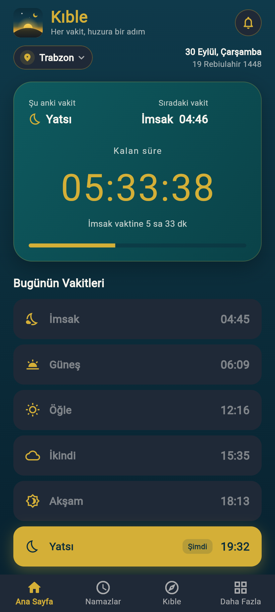
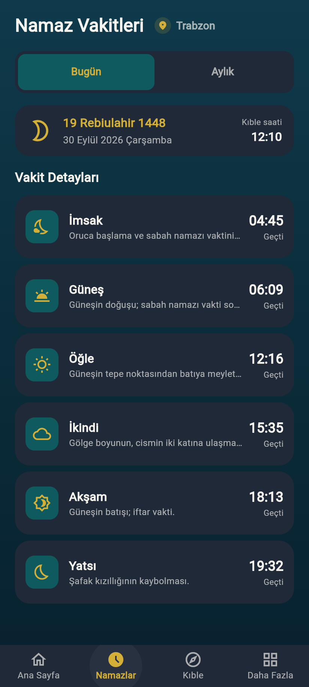
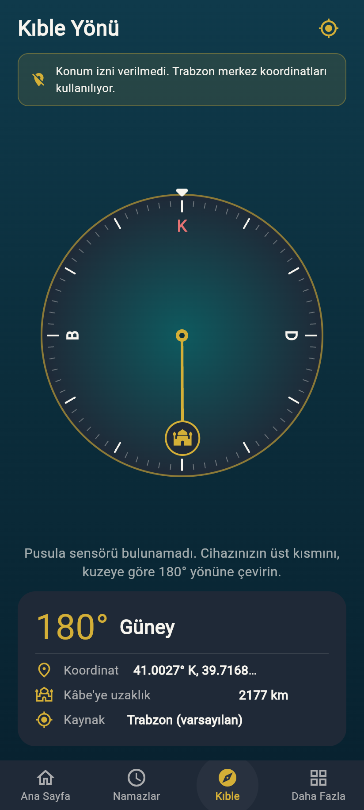
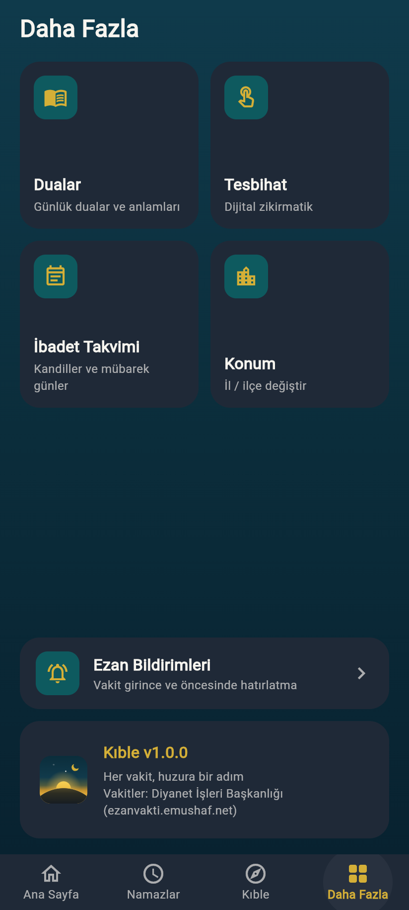

# Kıble

> Her vakit, huzura bir adım

Namaz vakitleri (Diyanet — [ezanvakti.emushaf.net](https://ezanvakti.emushaf.net)) ve kıble pusulası uygulaması.

## Kurulum

```bash
flutter pub get
flutter test      # birim + widget testleri
flutter run                # bağlı cihaz / emülatör
flutter run -d chrome      # web önizleme (pusula ve bildirim yok)
```

## Ekran görüntüleri

| Ana Sayfa | Namazlar | Kıble | Daha Fazla |
|---|---|---|---|
|  |  |  |  |

## Tam ekran düzen

Uygulama kenardan kenara çizilir (Android'de çentik alanı dahil, web'de `viewport-fit=cover`).
Ana Sayfa, Namazlar › Bugün, Kıble ve Daha Fazla ekranları kaydırma olmadan her telefon boyuna sığar;
kısa ekranlarda slogan, açıklamalar gibi ikincil öğeler gizlenir. `test/app_smoke_test.dart` bunu
320×568'den 430×932'ye dört ekran boyutunda doğrular. Uzun listeler (aylık vakitler, dualar,
ibadet takvimi, il/ilçe seçimi) kaydırılabilir kalır.

## Mimari

```
lib/
├── main.dart                     # Giriş, Provider kurulumu, tema
├── core/
│   ├── constants/app_constants.dart   # API adresi, varsayılan ilçe (Trabzon=9905), Kâbe koordinatı
│   ├── theme/                         # Renk paleti ve koyu tema
│   └── utils/                         # Biçimlendiriciler, hicri takvim, astronomik yeni ay
├── models/                       # DailyPrayerTimes, PrayerType, Region, SelectedLocation
├── services/
│   ├── api_service.dart          # /sehirler, /ilceler, /vakitler uç noktaları
│   ├── storage_service.dart      # Seçilen konum + çevrimdışı önbellek
│   └── qibla_service.dart        # Kıble açısı, mesafe, konum
├── providers/                    # PrayerProvider, QiblaProvider (ChangeNotifier)
├── data/                         # Dualar, dini günler
├── widgets/                      # Ortak bileşenler
└── screens/
    ├── main_shell.dart           # BottomNavigationBar (4 sekme)
    ├── home/                     # Ana Sayfa + geri sayım kartı
    ├── prayers/                  # Bugün detayları + aylık liste
    ├── qibla/                    # Pusula
    ├── more/                     # Dualar, Tesbihat, İbadet Takvimi
    └── location/                 # İl / ilçe seçimi
```

## API

| Uç nokta | Açıklama |
|---|---|
| `GET /sehirler/2` | Türkiye'deki iller |
| `GET /ilceler/{sehirId}` | İlin ilçeleri (Trabzon = 574) |
| `GET /vakitler/{ilceId}` | ~30 günlük vakitler (Trabzon merkez = 9905) |

## Ezan bildirimleri

Daha Fazla › Ezan Bildirimleri (veya ana sayfadaki zil simgesi):

- Vakit bazında aç/kapat (Güneş varsayılan kapalı), isteğe bağlı 5–45 dk önceden hatırlatma, test bildirimi
- Vakitler ilçenin saat dilimine göre (API: `GreenwichOrtalamaZamani`) UTC'ye çevrilip planlanır
- Uygulama her açıldığında ve konum/veri değiştiğinde yeniden planlanır; iOS'ta en fazla 60 bekleyen bildirim (≈ 6–10 gün), Android'de 30 günlük verinin tamamı
- Varsayılan bildirim sesi kullanılır. Ezan sesi için: Android'de `android/app/src/main/res/raw/ezan.mp3`, iOS'ta Runner hedefine `ezan.caf` ekleyip `NotificationService._details` içinde `sound` parametresini verin
- Web'de bildirim desteklenmez

## Widget'lar ve bildirim merkezi

Uygulama önümüzdeki ~30 günün vakitlerini ortak depolamaya yazar (`lib/services/widget_service.dart`);
yerel widget'lar sıradaki vakti ve geri sayımı bu veriden kendileri hesaplar, uygulama açılmasa da çalışır.

**Android** (`android/app/src/main/kotlin/com/kible/kible/`)
- `KibleWidgetProvider` — ana ekran / kilit ekranı widget'ı (4×2, yeniden boyutlandırılabilir)
- `KibleUpdater` + `KibleUpdateReceiver` — her vakit girişinde widget'ı ve kalıcı bildirimi yeniler
- Kalıcı bildirim: Ezan Bildirimleri › "Bildirim panelinde göster" (sıradaki vakte geri sayar)

**iOS** (`ios/KibleWidget/`) — ana ekran (küçük/orta), Bugün görünümü (Bildirim Merkezi) ve kilit ekranı
widget'ları. Hedefi Xcode'da bir kez eklemek gerekir:

1. `open ios/Runner.xcworkspace` → File › New › Target › **Widget Extension**, adı `KibleWidget`
   ("Include Live Activity" / "Configuration Intent" kapalı), iOS 17+
2. Xcode'un oluşturduğu Swift dosyalarını silip `ios/KibleWidget/KibleWidget.swift`, `Info.plist` ve
   `KibleWidget.entitlements` dosyalarını hedefe ekleyin
3. **Runner** ve **KibleWidget** hedeflerinde Signing & Capabilities › + App Groups ›
   `group.com.kible.kible` (Runner için `ios/Runner/Runner.entitlements` hazır)
4. Runner › Build Phases'te "Embed Foundation Extensions" adımını "Run Script"ten önceye alın

## Uygulama ikonu

Kaynak: `assets/icon/kible_icon.svg` (1024×1024). PNG'yi güncelledikten sonra:
`dart run flutter_launcher_icons`. Uygulama içindeki logo (`lib/widgets/kible_logo.dart`) aynı sahneyi
çizer; hilal hafifçe sallanır ("Hareketi azalt" açıkken durur).

## Platform izinleri

Kıble ekranı cihaz konumunu kullanır (izin verilmezse Trabzon merkez koordinatları kullanılır). Aşağıdaki izinler projede tanımlıdır:

- **Android** — `android/app/src/main/AndroidManifest.xml`: `INTERNET`, `ACCESS_COARSE_LOCATION`, `ACCESS_FINE_LOCATION`, `POST_NOTIFICATIONS`, `SCHEDULE_EXACT_ALARM`, `RECEIVE_BOOT_COMPLETED` (+ bildirim alıcıları, core library desugaring)
- **iOS** — `ios/Runner/Info.plist`: `NSLocationWhenInUseUsageDescription`; `AppDelegate.swift`: ön planda bildirim gösterimi

Not: Android'de pusula manyetik kuzeyi gösterir; Türkiye'de manyetik sapma ~5–6° doğudur.
